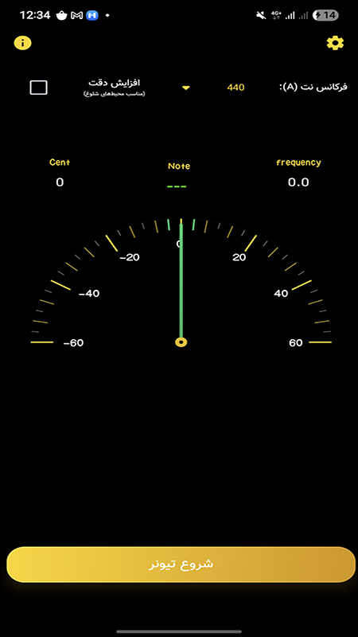

# 🎵 تیونر لا بمل (Ab Tuner)

تیونر لا بمل یک اپلیکیشن دقیق برای کوک کردن سازهای موسیقی ایرانی است. 
این تیونر به طور خاص برای نوازندگانی طراحی شده که با کوک‌های خاص (مانند کوک ربع پرده‌ای یا کوک‌های سنتی ایرانی) کار می‌کنند.

## 📱 ویژگی‌ها

- شناسایی دقیق نت کرن در تمامی اکتاوها
- نمایش اختلاف فرکانس بر حسب سنت (Cent)
- رابط کاربری ساده و سریع با نشانگر سوزنی

## ⚙️ تکنولوژی‌ها

- زبان برنامه‌نویسی: Kotlin
- رابط کاربری: Jetpack Compose
- پردازش صدا: [TarsosDSP](https://github.com/JorenSix/TarsosDSP)
- 
##

  